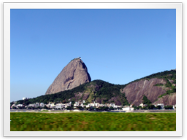

<h1 align="center">Grabber</h1>

Imageboard/booru downloader which can download thousands of images from multiple boorus very easily.

Thanks to its powerful naming features, you just have to set your filename and save directory using all the tokens available, and the program will generate a filename using the image's information. With this, you can store and manage your pictures in advanced directory structures, and save image with custom filenames!

Grabber works on Windows, Mac, and Linux. It is available in English, French, Russian, simplified Chinese, and Spanish.

## Download
You can download the latest release [here](https://github.com/Bionus/imgbrd-grabber/releases/latest), or find all previous releases [here](https://github.com/Bionus/imgbrd-grabber/releases).

For users interested, a nightly version is built automatically on every commit on the `develop` branch, and can be downloaded [here](https://github.com/Bionus/imgbrd-grabber/releases/nightly). Note that it might be less stable than official releases, so use at your own risk.

## Features

### Browse

* Tabs to make multiple searches at the same time
* Able to show results from multiple imageboards at the same time in a single tab
* Remove duplicate results from multiple-imageboard searches
* Auto-completion of tags in the search field
* Blacklisting of tags to mark or hide images you don’t want to see
* Proxy support
* Post-filtering (when the imageboard search is limited)
* Auto-download images as you search according to a whitelist

### Download

* Download thousands of images at once
* Download single images using their MD5 or ID
* Command line interface to download images

&nbsp;

&nbsp;

&nbsp;

&nbsp;

&nbsp;

### Customize

* Add your own imageboards very easily
* Authentication for sources behind a login wall
* Theme support using CSS. See Themes for details.
* Lots of options to customize the program’s behaviour

&nbsp;

&nbsp;

&nbsp;

### Organize

* Save images using a custom format, for example `%artist%/%copyright%/%character%/%md5%.%ext%`, or using JavaScript code. See Filename for details.
* Favorite tags to keep track of new images
* "View it later" tags to save a search for later
* Support saving images directly to a local booru, such as Shimmie, Gelbooru or MyImouto.
* Can add entries to a database for each image or tag while downloading. See Commands for details.
* Conditional filenames triggered by a tag
* Rename already downloaded images

## Default sources
You can add additional sources very easily, but here's a short list of some sources that are included and supported by default: Danbooru, Gelbooru, yande.re, Shimmie, e621, Konachan, rule34, safebooru, behoimi, Zerochan...

## Compilation
See the [Compilation](https://github.com/Bionus/imgbrd-grabber/wiki/Compilation) wiki page to know how to build Grabber.

## Contributors
<!-- ALL-CONTRIBUTORS-LIST:START -->
<!-- prettier-ignore -->
| [ <b>Jack Vasti</b>](https://github.com/Bionus) [💻](https://github.com/Bionus/imgbrd-grabber/commits?author=Bionus "Code") [📖](https://github.com/Bionus/imgbrd-grabber/commits?author=Bionus "Documentation") [⚠️](https://github.com/Bionus/imgbrd-grabber/commits?author=Bionus "Tests") | [ <b>YMI</b>](https://github.com/Zzzyyzzyxx) [🐛](https://github.com/Bionus/imgbrd-grabber/issues?q=author%3AYMI "Bug reports") [🤔](#ideas-YMI "Ideas, Planning, & Feedback") | [ <b>SultrySamthepenna&hellip;</b>](https://github.com/SultrySamthepennanceman) [🐛](https://github.com/Bionus/imgbrd-grabber/issues?q=author%3ASultrySamthepennanceman "Bug reports") | [ <b>Barry Anders</b>](https://github.com/BarryMode) [💻](https://github.com/Bionus/imgbrd-grabber/commits?author=BarryMode "Code") [🐛](https://github.com/Bionus/imgbrd-grabber/issues?q=author%3ABarryMode "Bug reports") | [ <b>Ken Swenson</b>](https://github.com/Flat) [💻](https://github.com/Bionus/imgbrd-grabber/commits?author=Flat "Code") [📦](#platform-Flat "Packaging/porting to new platform") | [ <b>Larry He</b>](https://github.com/larry-he) [💻](https://github.com/Bionus/imgbrd-grabber/commits?author=larry-he "Code") |
| :---: | :---: | :---: | :---: | :---: | :---: |
| [ <b>brodycas3</b>](https://github.com/brodycas3) [🐛](https://github.com/Bionus/imgbrd-grabber/issues?q=author%3Abrodycas3 "Bug reports") | [ <b>Klion Xu</b>](https://github.com/sanddudu) [🌍](#translation-sanddudu "Translation") | [ <b>MasterPetrik</b>](https://github.com/MasterPetrik) [🐛](https://github.com/Bionus/imgbrd-grabber/issues?q=author%3AMasterPetrik "Bug reports") [🌍](#translation-MasterPetrik "Translation") [🤔](#ideas-MasterPetrik "Ideas, Planning, & Feedback") | [ <b>Eddy Castillo</b>](https://github.com/dyskette) [🌍](#translation-dyskette "Translation") | [ <b>MrAndre96</b>](https://github.com/MrAndre96) [🐛](https://github.com/Bionus/imgbrd-grabber/issues?q=author%3AMrAndre96 "Bug reports") |
<!-- ALL-CONTRIBUTORS-LIST:END -->

This project follows the [all-contributors](https://github.com/kentcdodds/all-contributors) specification.
Contributions of any kind are welcome!