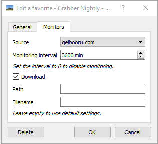

# Introduction

When you very often browse or download a certain tag and never want to miss any of its images, you may want to consider using the favorites tab. It allows you to never miss any new image that could have been posted.

# Adding a favorite

## From a search
Just search the tag you want to add to your favorites, and then right-click the tags field, and choose "Favorites > Add". Using this method, you can add favorites containing multiple tags: all tags currently being searched will be added as one favorite.

## From an image
If you opened an image window, just right-click the tag you want to add to your favorites and choose "Add to favorites".

# Removing a favorite

## From a search
Just search the tag you want to remove from your favorites, and then right-click the tags field, and choose "Favorites > Remove".

## From an image
If you opened an image window, just right-click the tag you want to remove from your favorites and choose "Remove from favorites".

## From the favorites tab
Right click a favorite to bring up its options, and then click the "Delete" button.

# Changing the favorite's image

## From an image
If you opened an image window containing the favorite tag, just right click this tag and choose "Set image". The current image will now be used as the favorite's image.

## From the favorites tab
Right click a favorite to bring up its options, and then click "Browse" to choose an image file. This file will then be used as the favorite's image.

# Using the favorites tab

When you have added your favorites, just left-clicking will browse the last results for this favorite. When you are done seeing all the images, you can click the "Mark as viewed" button. Now all these images will be hidden in future searches for this favorite (it only applies in this tab: searching for the favorite in any other tab will display all the results normally). You can also mark all the favorites as viewed using the "Mark all as viewed button".

If you clicked the button inadvertently, you can change the favorite's date manually in its options, which you can open right-clicking said favorite.

# Automatically download a favorite

To automatically download any new favorites, please follow the below steps:

1. Go to the "Favorites" tab
2. Right click on the Favorite you would like to monitor
3. Go to the "Monitors" tab
4. Select the source to pull updated files from as well as an interval in minutes

*Note: you can change the Path and Filename fields if needed, leaving blank will use your default path and filename.*

