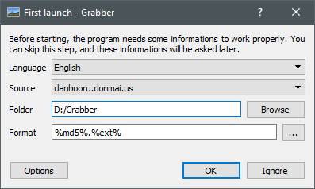
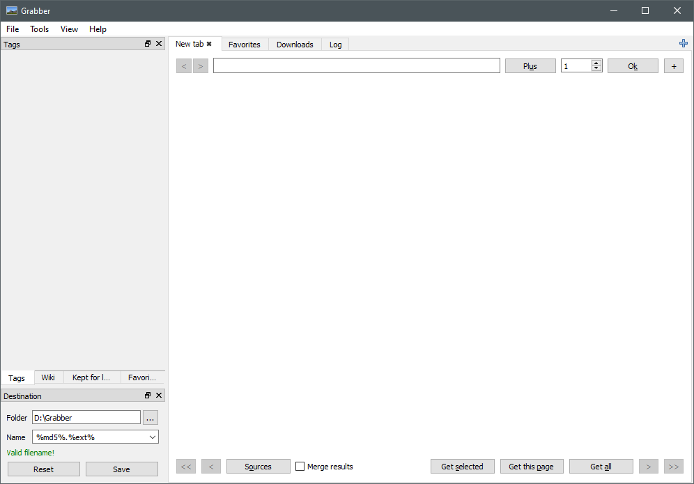
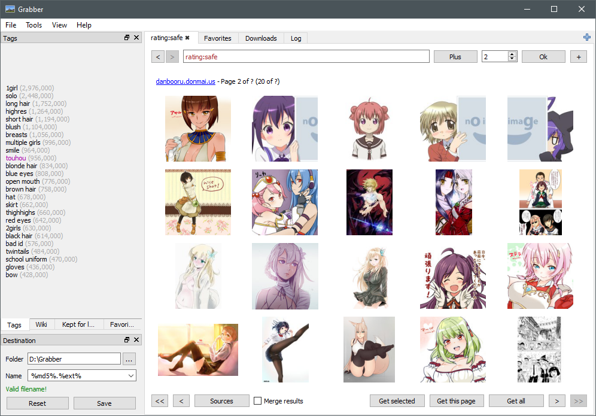
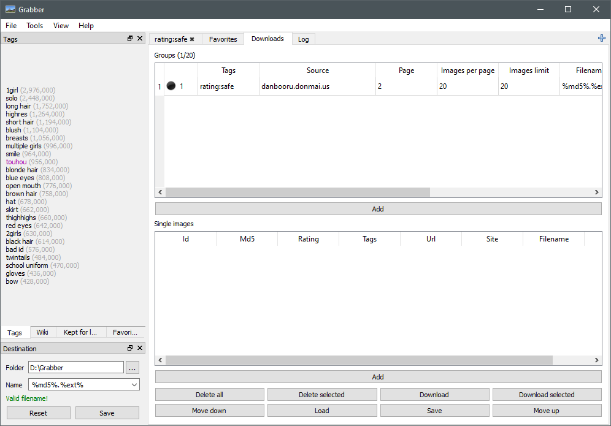
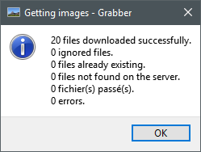
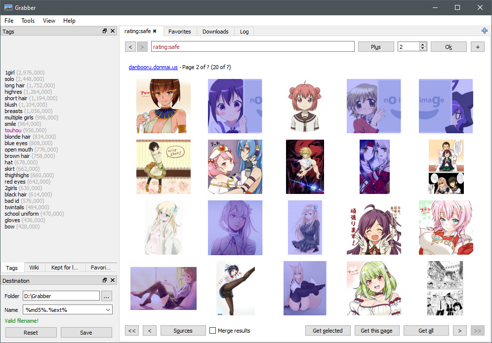
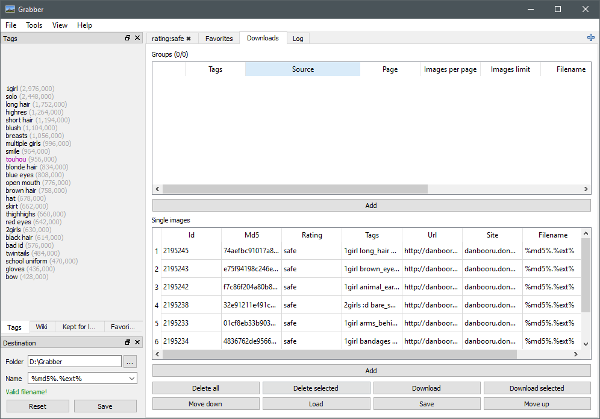
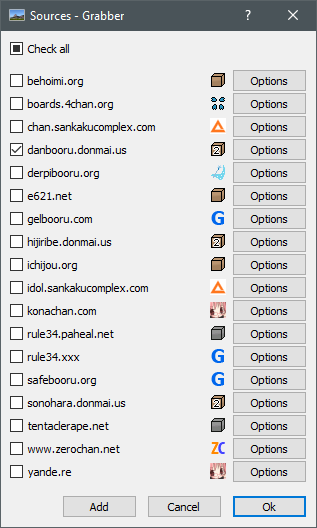
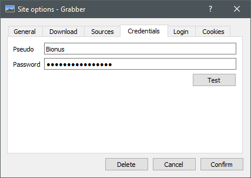
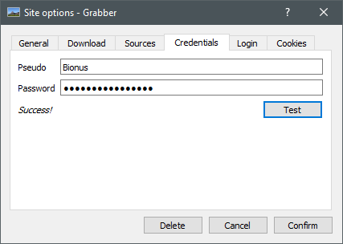

# Installation

## Windows

1. Download the latest Windows installer [here](https://github.com/Bionus/imgbrd-grabber/releases/latest).
2. Launch the installer, then follow the instructions. By default, the program will be installed to "C:/Program Files/Grabber" (note that all your settings will be stored in "%USERPROFILE%/AppData/Local/Bionus/Grabber").
3. If you haven't left the "start Grabber" checked at the end of the installation, go to the installation folder, then launch "Grabber.exe" (or use the shortcut created on the desktop during the installation).

## Arch Linux

Grabber can be installed from the aur package [imgbrd-grabber-git](https://aur.archlinux.org/packages/imgbrd-grabber-git/), and otherwise installed by following the generic Linux instructions. After installation see [Linux Configuration](#linux-configuration)

## Linux
Compile Grabber by following the instructions on the [compilation](../Compilation#linux) page. Upon completion run `make install`.

### Linux Configuration
After installation you will need to copy the example configuration files to your local Grabber directory. this is usually `~/.Grabber` the example files are located at `$INSTALLATIONPREFIX/Grabber/example/` Grabber will not run without these files.

# Usage

## First launch

When you first start the program, you should be welcomed with this window:

There are four fields to fill:

* Language: the interface language
* Source: the source you want to try first, you can change it later, and even select more than one at a time
* Folder: where you want to store your images
* Filename: the biggest strentgh of Grabber is its filename formatting! See the [Filename](Filename) wiki page for more details. The default value of `%md5%.%ext%` should be good at first.

Once finished, you can press the "Ok" button.

*Note: if you have ignored the window that opened at first launch, you can set these settings in "Edit > Options".
Then, go the the "Save" part. Set the "Folder" and the "Filename" fields (it is in a subpart of the "Save" part, you may need to expand it).*

You should now be seeing something like this:

## Searching

The upper part of the window is "divided" into two parts:

  * The search form: to make searches using tags. To insert a date, or access advanced features, you can click the "Plus" button. You can also browse other pages by changing the page value on the right.
  * Hidden form: you can show it by clicking the "+" button. Here, you have some fields to quickly change the settings (images per page and columns), the sources and "Post-filtering". Post-filtering allows you, for example, to bypass the two tags limitation of Danbooru by adding additional tags or metas (source, id, height, etc.) in this field. Note that none of these fields will be saved at exit, so if you want to definitely change the number of images per page or columns for example, you have should change them directly in the options.

After searching for something, you should see something as:

## Downloading

### Batch downloads

To download a lot of pictures at the same time, first search for the tag you want to download (or no tag if that's what you want). You should arrive on the search page. From here, just click "Get this page" to download all the images on the page you are currently seeing (usually around 20 images), or "Get all" to download all the results of your search, including further pages (can go from 1 images to thousands).

Then, go to the "Downloads" tab to have a summary or what will be downloaded:

Once you are satisfied with your download list, click the "Download" button to start the download. This window should then appear:

It lists all the images that will be or are already downloaded. Now, you just have to wait. When all images are downloaded, the program will tell you and show you a summary:

Success!

### Single images

To download single images, you have to "Ctrl + click" the images you want to download in the search window. They should then be marked in blue.

One you have selected all the images you want to download, click the "Get selected" button. It will mark these images to be downloaded in the "Downloads" tab:

Once you are satisfied with your download list, click the "Download" button.

## Sources

### Basic usage

If you want to change the source of the pictures, just click the "Sources button" at the bottom of the window:

Here, you just have to check the sources you want and then click "Ok".

### Multiple sources

If you select multiple sources, they will be put in one column by default. You can change this behavior by editing the "Columns" settings in the options.

Note that you can also merge all results to remove duplicates checking the "Merge results" option at the bottom of the window. It is useful if you browse from sites than mirror each others, while still having their own uploaders.

### Logging in

Some sources (for example Danbooru or Gelbooru) require to login to enable full API access. Even though it is usually not mandatory thanks to the regex fallback, it is usually strongly advised to do so.

To log in a source, just enter your credentials in the "Credentials" tab of the source settings window:

When you're done, you can click the "Test" button to check if your credentials are correct. Note that not all source support login checking.

Success!