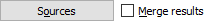

_Note: shortcuts marked with `*` might change depending on your platform._

# Mnemonics

Also called "Access keys", those are the underlined characters you can find in menu titles or buttons around the user inteface. The underlined character correspond to the key to open the menu / click the button when in conjunction with the <kbd>Alt</kbd> key.

Sometimes, the underline only appears when pressing the <kbd>Alt</kbd> key.

## Example

In this example, there are two shortcuts available:
* <kbd>Alt+O</kbd> to open the sources window
* <kbd>Alt+M</kbd> to toggle the "merge results" feature

# Main window

| Shortcut | Action |
|---|---|
| <kbd>Ctrl+W</kbd>`*` | Close tab |
| <kbd>Ctrl+L</kbd> | Focus search field |
| <kbd>Ctrl+PageDown</kbd> | Go to the next tab |
| <kbd>Ctrl+PageUp</kbd> | Go to the previous tab |
| <kbd>Ctrl+T</kbd>`*` | New tab |
| <kbd>Ctrl+Q</kbd>`*` | Quit the application |
| <kbd>Ctrl+O</kbd>`*` | Open save directory in file browser |

# Downloads tab

| Shortcut | Action |
|---|---|
| <kbd>Delete</kbd> | Remove selected downloads |

# Image window

## Normal mode

| Shortcut | Action |
|---|---|
| <kbd>Escape</kbd> | Close the window |
| <kbd>Ctrl+S</kbd>`*` | Save the image |
| <kbd>Ctrl+Shift+S</kbd>`*` | Save the image as |
| <kbd>Right arrow</kbd> | Go to the next image |
| <kbd>Left arrow</kbd> | Go to the previous image |
| <kbd>Ctrl+C</kbd>`*` | Copy the image's raw data to the clipboard |
| <kbd>F11</kbd>`*` | Toggle full-screen mode |

## Full-screen mode

| Shortcut | Action |
|---|---|
| <kbd>Escape</kbd> | Leave full-screen mode |
| <kbd>F11</kbd>`*` | Leave full-screen mode |
| <kbd>Right arrow</kbd> | Go to the next image |
| <kbd>Left arrow</kbd> | Go to the previous image |
| <kbd>Space</kbd> | Toggle slideshow |