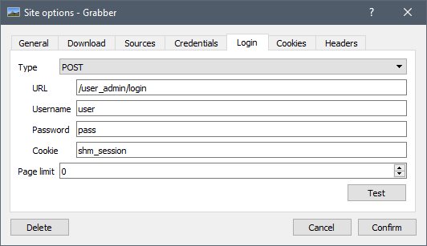

# Logging into a source

## Credentials

To log into a source, all you have to do is to open the settings of the source you want to log into and enter your credentials there.

1. Click the "Sources" button at the bottom of any search tab
2. Click the "Options" button in front of the website you want to log into
3. Go to the "Credentials" tab
4. Enter your username and password (if the site provides an API key, put it in the password field)

For security reasons, some sources require you to hash your password.

1. If the "Hash password" button is present, click it
2. Enter your password in the window that just opened
3. Click "Ok"
4. The password field should have been filled with your "password hash", which looks something like "b842ee4b63ff70e4bfb8537593b295a5f95f3710"

Click "Confirm" at the bottom of the site settings window, and you're done! Further requests on that website will use your credentials.

## Login methods

For some sources, simply adding the credentials is not enough. You may have to go to the "Login" tab of the site options and input more settings there. There are two main login methods: "Through URL" and "POST".

### Through URL

With the "Through URL" method, your credentials (often hashed) are passed directly in the URL of the request. This way, for every request sent, the site can check your identity. For this mode, you don't need to fill anything in this tab.

### POST

With the "POST" method, Grabber will first login to the website just like a real user would do: it will fill a form and send the data to the site. It will then check your identity, and on success save a "session cookie" that will identify you until you close the program.

For this method, more information is required for Grabber to be able to log you in:
* The login form's action page (e.g. `<form action="%value%">`)
* The username field (e.g. `<input type="text" name="%value%" />`)
* The password field (e.g. `<input type="password" name="%value%" />`)
* The cookie name, that will be checked to see if the login was successful or not: if the cookie is still empty after the request, Grabber will consider the login as failed

Here's an example of an HTML form and its associated settings.

```html
<form action='/user_admin/login' method='POST'>
    <table summary='Login Form' align='center'>
        <tr>
            <td width='70'>Name</td>
            <td width='70'><input type='text' name='user'></td></tr>
        <tr>
            <td>Password</td>
            <td><input type='password' name='pass'></td></tr>
        <tr>
            <td colspan='2'><input type='submit' name='gobu' value='Log In'></td>
        </tr>
    </table>
</form>
```



To know the cookie name, you have to log into the website and check the cookies that were created.