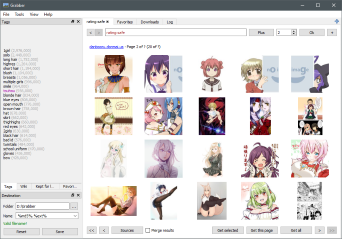
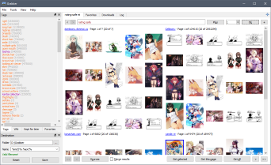
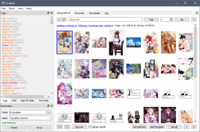
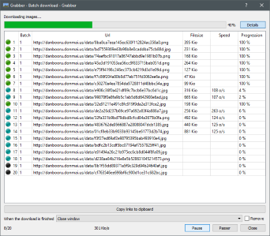
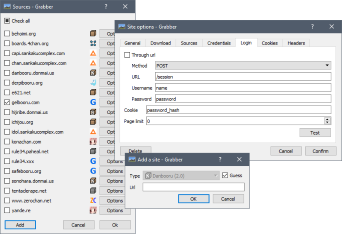
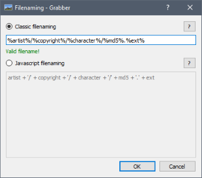
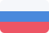

Imageboard/booru downloader which can download thousands of images from multiple boorus very easily. It can either be used through its graphical user intertface or command-line.

Thanks to its powerful naming features, you just have to set your filename and save directory using all the tokens available, and the program will generate a filename using the image's information. With this, you can store and manage your pictures in advanced directory structures, and save image with custom filenames!

Grabber works on Windows, Mac, and Linux.

# Downloads



[Windows (x64)]({{ asset.browser_download_url }})





[Windows (x86)]({{ asset.browser_download_url }})





[Linux (AppImage)]({{ asset.browser_download_url }})





[Linux (tar.gz)]({{ asset.browser_download_url }})





[MacOS (dmg)]({{ asset.browser_download_url }})





[Android]({{ asset.browser_download_url }})



# Sources

<i>Note that those are only a few sources present by default, but you can add as many as you want very easily!</i>

Danbooru

Gelbooru

Shimmie

Yande.re

e621

Konachan

Zerochan

rule34

Safebooru

Behoimi

# Features

## Browse

* Tabs to make multiple searchs at the same time
* Able to show results from multiple imageboards at the same time in a single tab
* Remove duplicate results from multiple-imageboard searches
* Auto-completion of tags in the search field
* Blacklisting of tags to mark or hide images you don't want to see
* Proxy support
* Post-filtering (useful for imageboards limiting the number of tags you can use in a single search)
* Auto-download images as you search according to a whitelist

## Download

* Download thousands of images at once
* Download single images using their MD5 or ID
* Command line interface to download images

## Customize

* Add your own imageboards very easily
* Authentication for sources behind a login wall
* Theme support using CSS. See [Themes](https://github.com/Bionus/imgbrd-grabber/wiki/Themes) for details.
* Lots of options to customize the program's behaviour

## Organize

* Save images using a custom format, for example `%artist%/%copyright%/%character%/%md5%.%ext%`, or using Javascript code. See [Filename](https://github.com/Bionus/imgbrd-grabber/wiki/Filename) for details.
* Favorite tags to keep track of new images
* "View it later" tags to save a search for later
* Support saving images directly to a local booru, such as [Shimmie](https://github.com/Bionus/imgbrd-grabber/wiki/Shimmie), [Gelbooru](https://github.com/Bionus/imgbrd-grabber/wiki/Gelbooru) or [MyImouto](https://github.com/Bionus/imgbrd-grabber/wiki/MyImouto).
* Can add entries to a database for each image or tag while downloading. See [Commands](https://github.com/Bionus/imgbrd-grabber/wiki/Commands) for details.
* Conditional filenames triggered by a tag
* Rename already downloaded images

# Languages

English

French

Russian

Chinese (simplified)

Spanish

# Contact

If you have any questions about the program, found a bug and don't want to use the github issue tracker, or anything, you can contact me by mail in French or in English at [bio.nus@hotmail.fr](mailto:bio.nus@hotmail.fr).

Please prefer using Github's built-in [issue tracker](https://github.com/Bionus/imgbrd-grabber/issues) though, as the answer to your question or problem might help other people!